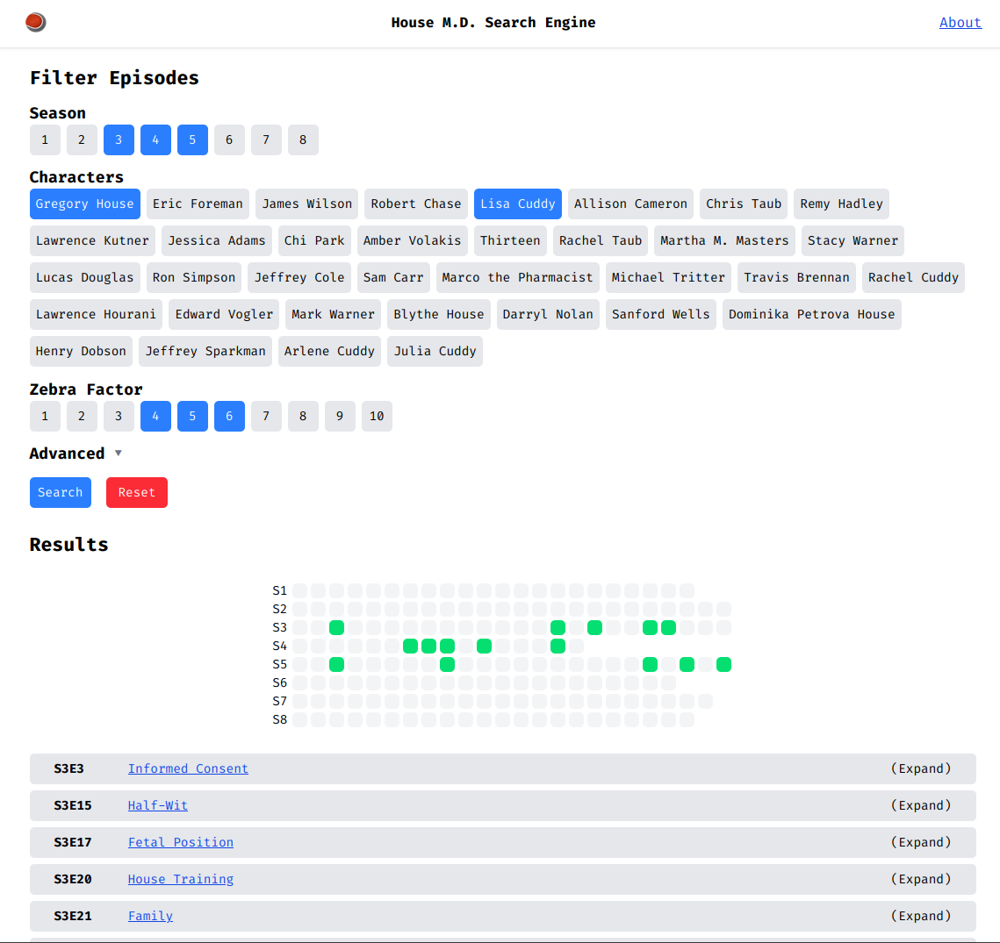

# House M.D. Search Engine

This is mostly a joke site to practice webscraping and some webdesign.

The site allows interactive filtering by the attributes and metadata of each episode and displays the results as a list and heatmap.
You can also share queries by sharing the url.

## Images

## Copyright

The metadata and information about each episode, the text content and all medical commentary were sourced from [house.fandom.com](https://house.fandom.com) and [politedissent.com](https://politedissent.com). This site only serves to aggregate and make the content searchable.

Content from [house.fandom.com](https://house.fandom.com) is licensed under CC-BY-SA.
Content from [politedissent.com](https://politedissent.com) is property of the website's owner.
